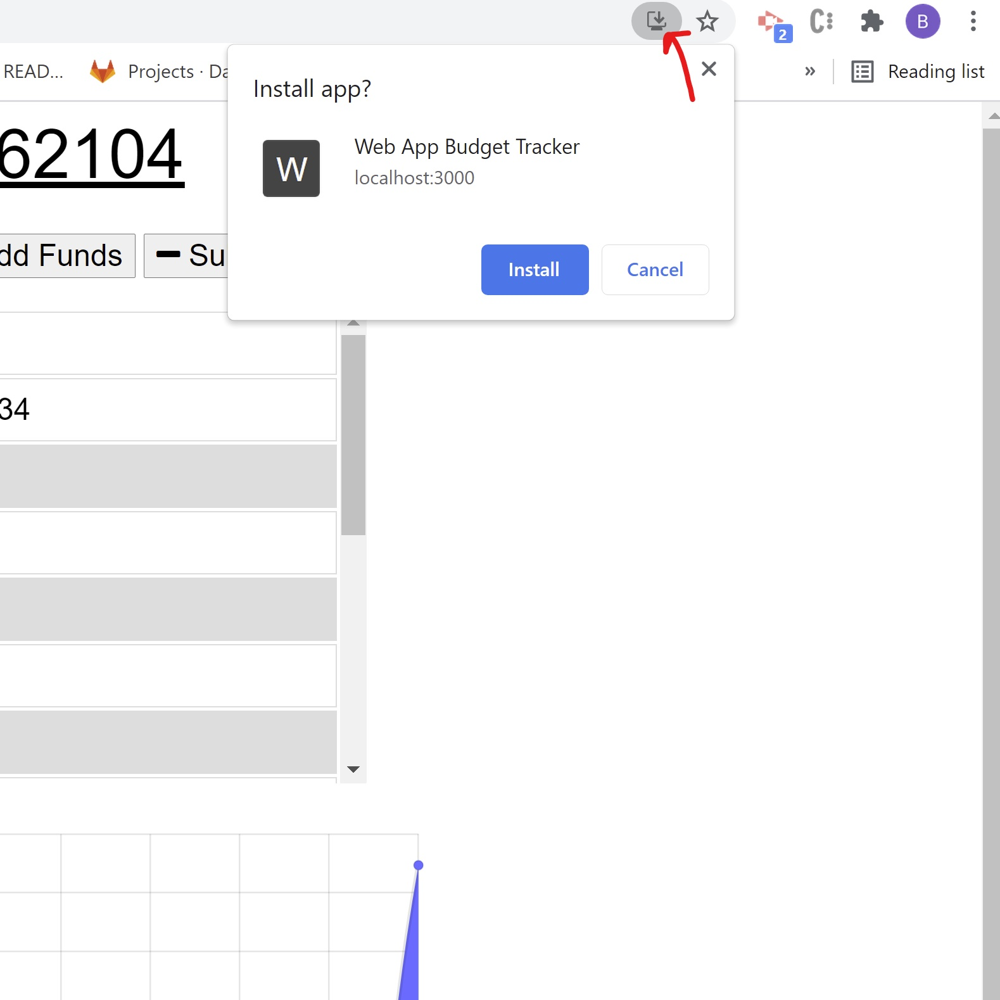
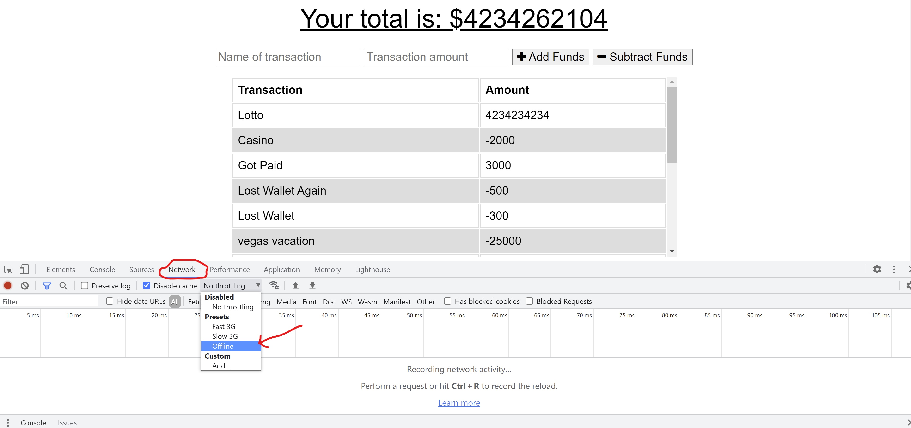

# Budget-Tracker

## Description

My motivation for creating this project was to get practice coverting an already existing applicaiton to a PWA (progressive web app),  that can be used offline if not connected to the internet. This application would be useful to anyone who wants to track their expenses and may not have access to an internet connection, perhaps while traveling abroad. During this project, I learned what an app requires to be a PWA and work offline. I also learned how to deploy to Heroku using MongoDB Atlas.

## Table of Contents

- [Installation](#installation)
- [Usage](#usage)
- [License](#license)
- [Tests](#tests)
- [Questions](#questions)

## Installation

Here is the link to the Github repository where the repo can be cloned (https://github.com/bwalters8910/budget-tracker). Here is the link to the deployed application ()

## Usage

To use the app, simply visit the deployed site. There's a button you can click in the searchbar to download the app to your local machine so the app can be used locally without an internet connection.

## License

[MIT](https://choosealicense.com/licenses/mit/)

## Tests

If you want to test the app's offline capabilites, click on the Network tab in the Dev Tools and change connection status to offline.

## Questions

Here is a link to my GitHub profile https://github.com/bwalters8910.